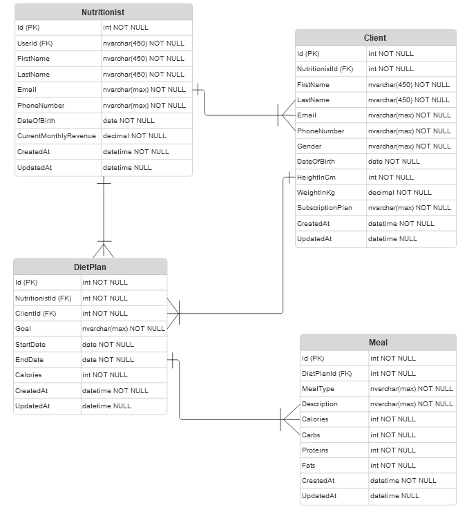

# FitTrek

## Table of Contents
- [Overview](#overview)
- [API Entities](#api-entities)
- [Authentication and Authorization](#authentication-and-authorization)
- [Installation and Configuration](#installation-and-configuration)
- [API Endpoints](#api-endpoints)
- [Seeder](#seeder)
- [How to Consume the API](#how-to-consume-the-api)

## Overview
**FitTrek** is a RESTful application that allows nutritionists to manage clients, diet plans, and meals. The API uses Role-Based Access Control (RBAC) and implements **ASP.NET Core Identity** for authentication and authorization. With it, nutritionists can create, read, update, and delete (CRUD) data related to clients, diets, and meals, while admins can manage nutritionists. The API is connected to a Microsoft SQL Server database.

### Key Features:
- **Admins** can manage nutritionists.
- **Nutritionists** can manage their clients, diet plans, and meals.
- The API implements role-based access control for users.
- It uses an authentication structure based on **ASP.NET Core Identity**.
- It uses the **Serilog** package to log data, which is stored daily in the **FitTrek.API/logs** folder.

## API Entities

<div style="text-align: center;">
    
    <p><em>Figure 1: Visual representation of the API entities.</em></p>
</div>

- **Nutritionist**: Represents a user who manages clients, diets, and meals.
- **Client**: Represents individuals who are assigned diet plans by nutritionists.
- **DietPlan**: Represents specific diet plans assigned to a client.
- **Meal**: Represents specific meals included in a diet plan.

## Authentication and Authorization
The API uses **ASP.NET Core Identity** for user authentication and authorization. All endpoints require the user to be authenticated via a **Bearer token**. The supported user roles are:

- **Admin**: Can manage and perform CRUD operations (create, read, update, and delete) on the nutritionist entity.
- **Nutritionist**: Can manage their clients, diet plans, and meals, and perform CRUD operations on these entities.

**Note**: Only admins can manage nutritionists. Nutritionists cannot manage other nutritionists or their clients or admins. Admins cannot manage the clients of nutritionists.

## Installation and Configuration

### Prerequisites
- **.NET SDK** version 7.0 or higher.
- **Microsoft SQL Server** (or another compatible SQL server).
- **Postman** or **Insomnia** to test requests (optional).
 
### Installation Steps
1. **Clone the repository:**
    ```bash
    git clone https://github.com/saulo-de-tarso/FitTrek.git
    cd FitTrek
    ```

2. **Configure the database:**
    Open the `appsettings.json` file and configure the connection string for your SQL Server.
    ```json
    "ConnectionStrings": {
        "DefaultConnection": "Server=your-server;Database=FitTrekDB;User Id=your-user;Password=your-password;"
    }
    ```

3. **Install dependencies:**
    ```bash
    dotnet restore
    ```

4. **Apply database migrations via the Package Manager Console:**
    **Important:** Apply the update with the default project set to **FitTrek.Infrastructure**, as the DbContext is located in the Infrastructure.
    ```bash
    update-database
    ```

5. **Run the application:**
    ```bash
    dotnet run
    ```
    The API will be accessible at `http://localhost:7279` by default.

## API Endpoints

### Authentication (Identity)

- **POST /api/identity/register** - No authentication required  
  **Description:** Registers a user in the application.
    ```json
    {
      "email": "youremail@email.com",
      "password": "yourpassword"
    }
    ```

- **POST /api/identity/login** - No authentication required  
  **Description:** Performs login and returns a Bearer token.
    ```json
    {
        "email": "youremail@email.com",
        "password": "yourpassword"
    }
    ```

  **Response:**
    ```json
    {
      "tokenType": "Bearer",
      "accessToken": "your-access-token",
      "expiresIn": 3600,
      "refreshToken": "refresh-token"
    }
    ```

- **POST /api/identity/userRole** - Authentication required  
  **Description:** Assigns a user role to a user. Accepted roles: Admin and Nutritionist.  
  If the role is Admin, only email and password are required.  
  If it’s a Nutritionist, the Nutritionist's Id must be provided.  
  For a Nutritionist, prior registration by an Admin through the **POST /api/nutritionists** endpoint is required.
    ```json
    {
        "userEmail": "user-email@example.com",
        "roleName": "user-role"
    }
    ```

- **DELETE /api/identity/userRole** - Authentication required  
  **Description:** Removes a user role from a user.
    ```json
    {
        "userEmail": "user-email@example.com",
        "roleName": "user-role"
    }
    ```

### Nutritionists - Authentication required (Only Admins are authorized)

- **POST /api/nutritionists**  
  **Description:** Creates a new nutritionist.  
  Validation: The email must be valid, and the phone number must be in the format `(XX) 9XXXX-XXXX`.
    ```json
    {
        "firstName": "FirstName",
        "lastName": "LastName",
        "email": "nutritionist-email@example.com",
        "phoneNumber": "(32) 91527-7307",
        "dateOfBirth": "2024-11-13"
    }
    ```

- **GET /api/nutritionists**  
  **Description:** Returns all nutritionists in the database.  
  The list can be filtered by name, and sorted by name or current monthly income, in ascending or descending order. Results are paginated, and the user can choose how many results to display per page (5, 10, 15, or 30).

- **GET /api/nutritionists/{id}**  
  **Description:** Returns data for a nutritionist by their Id.  
  If the Id doesn't exist, an exception will be returned stating that the nutritionist doesn't exist.

- **DELETE /api/nutritionists/{id}**  
  **Description:** Deletes a nutritionist by their Id.  
  If the Id doesn't exist, an exception will be returned stating that the nutritionist doesn't exist.

- **PATCH /api/nutritionists/{id}**  
  **Description:** Updates a nutritionist’s data by their Id.  
  If the Id doesn't exist, an exception will be returned stating that the nutritionist doesn't exist.  
  Partial data can be passed if the user wants to update only a specific property.  
  Validation: The email must be valid, and the phone number must be in the format `(XX) 9XXXX-XXXX`.
    ```json
    {
        "firstName": "FirstName",
        "lastName": "LastName",
        "email": "nutritionist-email@example.com",
        "phoneNumber": "(32) 91527-7307",
        "dateOfBirth": "2024-11-13"
    }
    ```
    
### Clients - Authentication required (Only Nutritionists are authorized)

- **POST /api/clients**  
  **Description:** Creates a new client for the logged-in nutritionist.  
  Validation: The email must be valid, and the phone number must be in the format `(XX) 9XXXX-XXXX`. The gender must be Male, Female, or Other. The subscription plan must be Silver, Gold, or Platinum. The monthly income for the nutritionist is based on the subscription plan:  
    - Silver = R$150/month  
    - Gold = R$300/month  
    - Platinum = R$600/month  
    ```json
    {
        "firstName": "FirstName",
        "lastName": "LastName",
        "email": "client-email@example.com",
        "phoneNumber": "(11) 92389-9533",
        "gender": "Male",
        "dateOfBirth": "2024-11-13",
        "heightInCm": 300,
        "weightInKg": 500,
        "subscriptionPlan": "Silver"
    }
    ```

- **GET /api/clients**  
  **Description:** Returns all clients registered in the database for the logged-in nutritionist.  
  The list can be filtered by name and sorted by name or current monthly income in ascending or descending order. Results are paginated, and the user can choose how many results to display per page (5, 10, 15, or 30).

- **GET /api/clients/{id}**  
  **Description:** Returns client data by their Id.  
  If the Id doesn’t exist or is associated with another nutritionist, an exception will be returned stating that the client doesn't exist.

- **DELETE /api/clients/{id}**  
  **Description:** Deletes a client by their Id.  
  If the Id doesn’t exist or is associated with another nutritionist, an exception will be returned stating that the client doesn't exist.

- **PATCH /api/clients/{id}**  
  **Description:** Updates a client’s data by their Id.  
  If the Id doesn’t exist or is associated with another nutritionist, an exception will be returned stating that the client doesn't exist.  
  Partial data can be passed if the user wants to update only a specific property.  
  Validation: The email must be valid, the phone number must be valid and in the format `(XX) 9XXXX-XXXX`. Gender must be Male, Female, or Other. Subscription Plan must be Silver, Gold, or Platinum. The nutritionist's monthly income is updated based on the Subscription Plan.  
    - Silver = R$150/month  
    - Gold = R$300/month  
    - Platinum = R$600/month  
    ```json
    {
        "firstName": "FirstName",
        "lastName": "LastName",
        "email": "client-email@example.com",
        "phoneNumber": "(11) 92389-9533",
        "gender": "Male",
        "dateOfBirth": "2024-11-13",
        "heightInCm": 200,
        "weightInKg": 500,
        "subscriptionPlan": "Silver"
    }
    ```

### Diet Plans - Authentication required (Only Nutritionists are authorized)

- **POST /api/dietplans**  
  **Description:** Creates a new diet plan for a client of the logged-in nutritionist.  
  If the client Id doesn’t exist or is associated with another nutritionist, an exception will be returned stating that the client doesn't exist.  
    ```json
    {
        "goal": "Weight loss",
        "startDate": "2024-11-13",
        "endDate": "2024-11-13",
        "calories": 0
    }
    ```

- **GET /api/dietplans**  
  **Description:** Returns all diet plans registered in the database for the provided client Id.  
  If the client Id doesn’t exist or is associated with another nutritionist, an exception will be returned stating that the client doesn't exist.  
  Results are paginated, and the user can choose how many results to display per page (5, 10, 15, or 30).

- **GET /api/dietplans/{id}**  
  **Description:** Returns data for a diet plan by its Id and the client Id.  
  If the client Id doesn’t exist or is associated with another nutritionist, an exception will be returned stating that the client doesn't exist.  
  If the diet plan Id doesn’t exist or is associated with another nutritionist, an exception will be returned stating that the diet plan doesn’t exist.

- **DELETE /api/dietplans/{id}**  
  **Description:** Deletes a diet plan by its Id and the client Id.  
  If the client Id doesn’t exist or is associated with another nutritionist, an exception will be returned stating that the client doesn't exist.  
  If the diet plan Id doesn’t exist or is associated with another nutritionist, an exception will be returned stating that the diet plan doesn’t exist.

- **PATCH /api/dietplans/{id}**  
  **Description:** Updates a diet plan’s data by its Id and the client Id.  
  If the client Id doesn’t exist or is associated with another nutritionist, an exception will be returned stating that the client doesn't exist.  
  If the diet plan Id doesn’t exist or is associated with another nutritionist, an exception will be returned stating that the diet plan doesn’t exist.  
  Partial data can be passed if the user wants to update only a specific property.  
    ```json
    {
        "goal": "Muscle gain",
        "startDate": "2024-11-13",
        "endDate": "2024-11-13",
        "calories": 0
    }
    ```


